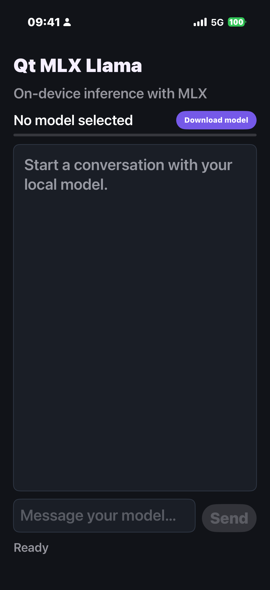
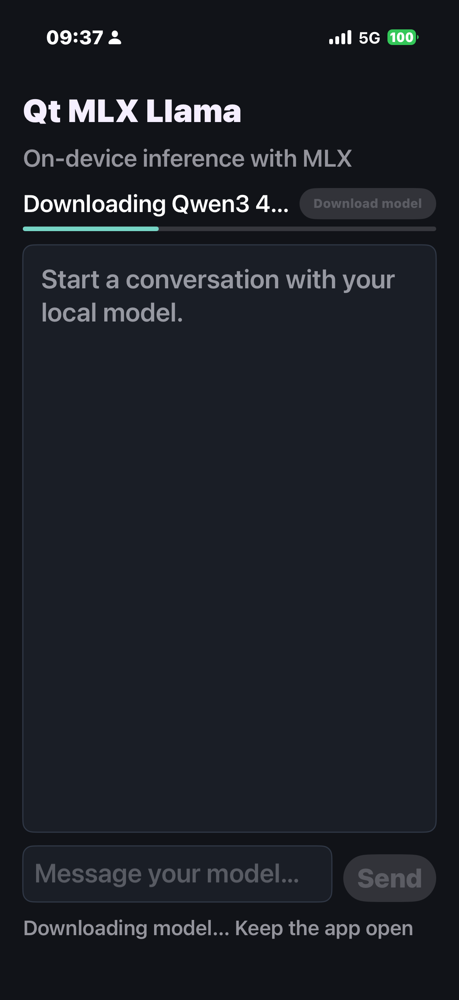
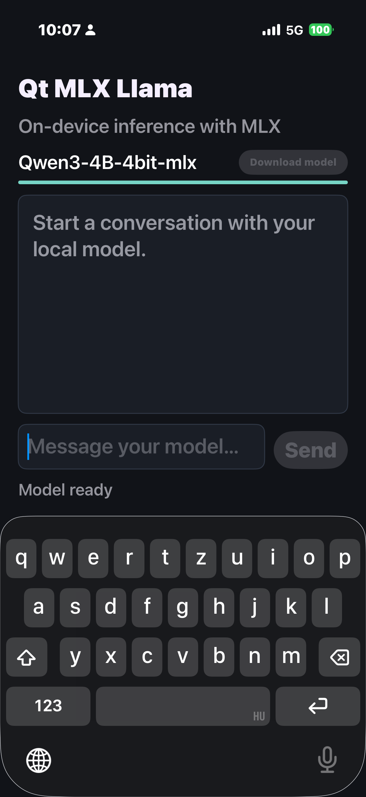

# QtLlamaSwiftUI

QtLlamaSwiftUI is a native iPhone and iPad chat app that runs Qwen3 locally
with [MLX Swift LM](https://github.com/ml-explore/mlx-swift-lm). Inference
happens on the device through the local `MLXQtBridge` Swift package; the app
does not require `llama.cpp` or an OpenAI-compatible server.

## Features

- Native SwiftUI chat interface
- On-device model inference with MLX
- Download progress and model-loading status
- Persistent model cache in the app's Application Support directory
- Multi-turn chat session with selectable response text
- iPhone and iPad support

The message field remains visible while the model is unavailable or
downloading, and becomes interactive after the model has downloaded and
loaded successfully.

## Screenshots

<table>
  <tr>
    <td></td>
    <td></td>
    <td></td>
  </tr>
  <tr>
    <td align="center">Select model</td>
    <td align="center">Downloading</td>
    <td align="center">Model ready</td>
  </tr>
</table>

## Requirements

- An Apple-silicon Mac
- Xcode with Swift 6 support
- [XcodeGen](https://github.com/yonaskolb/XcodeGen)
- iOS 17 or later
- A physical iPhone or iPad recommended for MLX inference
- An Apple development team for device installation
- Approximately 2.1 GB for the model download, plus additional free space for
  extraction and runtime data

A recent device with at least 6 GB of memory is recommended for the four-bit
4B model. The iOS Simulator is useful for UI development, but a physical
Apple-silicon device is the intended inference target.

## Project structure

```text
.
├── README.md                         SwiftUI app documentation
├── Assets.xcassets/                  App icon asset catalog
├── project.yml                       XcodeGen project definition
├── Screenshots/                      README screenshots
│   ├── model-selection.png
│   ├── model-downloading.png
│   └── model-ready.png
├── Sources/
│   ├── QtLlamaApp.swift              Application entry point
│   ├── ContentView.swift             Chat interface
│   └── ChatViewModel.swift           UI state and MLX bridge integration
└── Tests/
    └── ChatViewModelTests.swift      View-model unit tests
```

The app references `../MLXQtBridge` for model downloading, loading, and
on-device inference. That package has its own
`Tests/MLXQtBridgeTests/ModelManagerTests.swift` unit-test suite. Shared
property-list and privacy files live one directory above this app folder.

## Build and run

1. Generate the Xcode project with the command in the next section.
2. Open `QtLlamaSwiftUI.xcodeproj` in Xcode.
3. Select the `QtLlamaSwiftUI` target.
4. Under **Signing & Capabilities**, choose your development team and change
   the bundle identifier if necessary.
5. Select an iPhone or iPad running iOS 17 or later.
6. Build and run the `QtLlamaSwiftUI` scheme.

The project references `../MLXQtBridge` as a local Swift package. Xcode
resolves its pinned remote dependencies when the project is opened for the
first time.

After generating the project, a command-line simulator build can be run from
this directory:

```sh
xcodebuild \
  -project QtLlamaSwiftUI.xcodeproj \
  -scheme QtLlamaSwiftUI \
  -sdk iphonesimulator \
  -configuration Debug \
  CODE_SIGNING_ALLOWED=NO \
  build
```

### Generate the Xcode project

The Xcode project is generated locally from `project.yml` and is not stored in
the repository. Install XcodeGen, then generate it:

```sh
xcodegen generate
```

Do not edit generated project settings directly when the equivalent change
belongs in `project.yml`.

## Tests

Run the MLX bridge tests from this directory. They validate missing model
files and unloaded-model behavior without downloading or loading model
weights:

```sh
swift test --package-path ../MLXQtBridge
```

After generating the Xcode project, run the SwiftUI view-model tests with an
installed simulator:

```sh
xcodebuild test \
  -project QtLlamaSwiftUI.xcodeproj \
  -scheme QtLlamaSwiftUI \
  -destination 'platform=iOS Simulator,name=iPhone 16 Pro'
```

Replace the simulator name if `iPhone 16 Pro` is not installed.

## Download and use the model

The repository uses `https://example.com/model.zip` as a placeholder. Before
using **Download model**, update `defaultArchiveURL` in
`../MLXQtBridge/Sources/MLXQtBridge/MLXQtBridge.swift` to an HTTPS URL for a ZIP
archive containing the `Qwen3-4B-4bit-mlx` model files.

Code that creates `ModelManager` directly can instead inject the URL:

```swift
let manager = ModelManager(
    archiveURL: URL(string: "https://your-host.example/Qwen3-4B-4bit-mlx.zip")!
)
```

1. Launch the app and tap **Download model**.
2. Keep the app in the foreground while the archive downloads and extracts.
3. Wait until the status changes to **Model ready**.
4. Enter a prompt in **Message your model…** and tap **Send**.

The app downloads the configured archive over HTTPS, extracts it into
`Application Support/Models`, and loads it with MLX Swift LM. A completed
download is reused on later attempts instead of being downloaded again.

Generation uses these defaults:

- Maximum response length: 512 tokens
- Rotating KV cache: 2,048 tokens
- Temperature: 0.7

Deleting the app or its data removes the cached model.

## Optional model conversion

`convert_to_mlx.py` converts original Hugging Face-format weights to MLX on an
Apple-silicon Mac. It cannot convert a GGUF file because GGUF and MLX use
different formats and quantization layouts.

```sh
python3 -m venv .venv-mlx
source .venv-mlx/bin/activate
python -m pip install --upgrade pip
python -m pip install -r requirements-mlx-convert.txt
python convert_to_mlx.py
```

Run `python convert_to_mlx.py --help` to choose another source model, output
directory, quantization size, group size, revision, or Hugging Face upload
repository. Producing a local conversion does not automatically change the
model downloaded by the app; publish it as a ZIP archive and configure its URL
as described above.

## Troubleshooting

### The message field is disabled

The field is enabled only after the model is fully downloaded and loaded. If
the status says **Download failed**, check the network connection, available
storage, and the error shown in the conversation, then retry after relaunching
the app.

### The app exits while loading or generating

A four-bit 4B model still requires several gigabytes of memory. Close other
memory-intensive apps and try a newer device with more RAM.

### Xcode reports keyboard constraint warnings

Warnings mentioning `com.google.keyboard.KeyboardExtension`,
`_UIKBCompatInputView`, or `TUIKeyboardContentView` originate from a third-party
keyboard extension. Test with Apple's system keyboard to distinguish those
warnings from application layout issues.

### Metal reports unused-variable warnings

Warnings from `mlx/backend/metal/kernels` about unused constants are generated
while MLX compiles its Metal kernels. They are non-fatal when the log also
reports that compilation succeeded.

## Privacy

Prompts and responses are processed locally after the model is installed. A
network connection is required for the initial model and Swift package
downloads. Review `../PrivacyInfo.xcprivacy` and all linked SDK declarations
before distributing the app.
